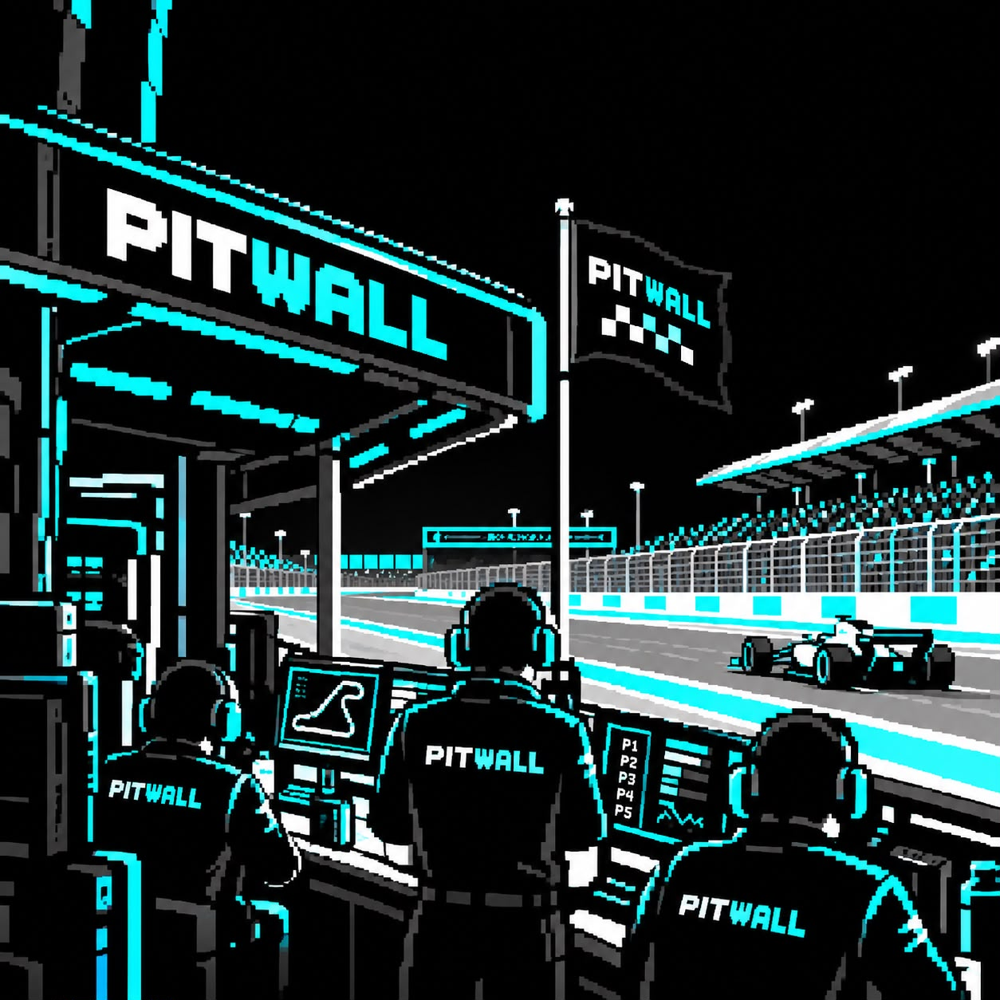

# 🏁 Pitwall

### Your AI workspace. At a glance.

**See what your AI agents are doing. Understand what changed.  
Pick up where you left off. Stay in control.**

---

## What is Pitwall?

When you work with AI coding agents, things can get busy very quickly.

Multiple terminals. Multiple projects. Multiple agents. Long-running tasks. Work continuing while you're away.

Eventually you start asking:

> **What is happening right now?**  
> **What changed while I was away?**  
> **Which agent needs my attention?**  
> **Where should I continue?**

**Pitwall is built to answer those questions.**

It gives you a small, always-visible view of your AI-assisted workspace, bringing together the activity of your terminals, coding agents and projects without replacing the tools you already use.

Think of it as the **pit wall for your AI development workspace**.

`SEE → UNDERSTAND → REMEMBER → RESUME → CONTROL`

---

## Why Pitwall?

AI coding has changed how we work.

Instead of one terminal and one developer, you might have:

- several AI coding agents working at the same time
- multiple projects open
- agents running in different terminals
- Master/Child agent teams
- work continuing while you're away
- tasks that finish and need your attention
- sessions that you need to return to later

Pitwall gives you a place to see the bigger picture.

You don't have to keep opening terminals just to figure out what is happening.

---

## What Pitwall does

### 👀 See

See your active workspace in one place.

Pitwall can show:

- projects
- terminals and applications
- AI coding agents
- running and completed sessions
- Master/Child agent relationships
- recent activity

### 🧠 Understand

Pitwall can turn workspace activity into a short AI-generated brief.

Instead of reading through several terminals, you can ask:

> **"What's going on?"**

and get a concise explanation of what matters.

AI summaries are optional and use your configured local AI agent.

### 📝 Remember

Pitwall can create checkpoints so important workspace state doesn't simply disappear when a session ends.

This makes it easier to remember:

- what was being worked on
- where a session stopped
- what needs to happen next

### ▶️ Resume

When you need to continue working, Pitwall can help you return to the right session or project.

No hunting through terminal windows.

### 🎛️ Control

Pitwall isn't just a dashboard.

Where supported, you can explicitly:

- focus a session
- stop a session
- close a window
- resume a session
- assign work to a selected agent

Actions are explicit. Pitwall does not silently take control of your workspace.

### 🔔 Notifications

Pitwall can surface meaningful events that need your attention.

For example:

- an agent finished
- a session disappeared
- an assignment completed
- something failed

The goal is **signal, not noise**.

---

## 🤖 Works with your AI agents

Pitwall is **not another AI coding agent**.

You continue using the tools you already like.

Pitwall sits around them and provides workspace awareness and continuity.

The project is designed to work with AI coding environments such as:

- OpenCode
- Claude Code
- Codex
- and other compatible agent workflows

Your agent does the coding.

**Pitwall helps you understand the work around it.**

---

## 🏁 Omarchy first

Pitwall currently has its first-class integration with **Omarchy**, using its native desktop and Quickshell environment.

This gives Pitwall a natural home in the desktop itself, rather than making it another application you need to keep open.

The longer-term goal is bigger:

> **Build a useful, open-source workspace awareness layer that can eventually reach developers across Linux environments, not just Omarchy.**

Omarchy is where we're starting.

---

# 🚀 Quick Start

Pitwall currently targets Linux and is developed first for Omarchy.

### 1. Clone the repository

    git clone https://github.com/omgxai/pitwall.git
    cd pitwall

### 2. Install Pitwall (recommended complete Omarchy setup)

    ./packaging/install.sh --enable-timer --enable-plugin

The installer builds Pitwall and installs the Omarchy integration for your user account.

No root installation is required.

- `--enable-plugin` enables the Pitwall Omarchy bar widget and places it after `omarchy.agents`.
- `--enable-timer` enables the background snapshot timer.
- Plain `./packaging/install.sh` remains available as the "install files only" path; then enable manually (step 3) if needed.

### 3. Enable the Pitwall plugin (fallback)

If you installed files only, enable the widget with:

    omarchy plugin enable dev.pitwall --after omarchy.agents

### 4. Start workspace observation

    pitwall snapshot

The first snapshot initializes current state immediately; otherwise the timer populates it on its normal interval.

For continuous observation:

    systemctl --user enable --now pitwall-snapshot.timer

### 5. Check your installation

    pitwall doctor

If everything is working, Pitwall should appear in your Omarchy environment.

If the panel does not appear immediately because of shell/QML reload state, use:

    omarchy restart shell

---

## 💬 Talk to your workspace

Pitwall can also open a native terminal conversation about the workspace it is observing:

    pitwall chat

You can ask questions about what is happening across your current workspace without having to inspect every terminal yourself.

---

## 🔒 Local-first

Pitwall is designed around a simple principle:

**Your development workspace should remain yours.**

Pitwall is local-first.

- No mandatory account
- No required cloud service
- No provider gateway
- No telemetry by default
- Workspace state stays on your machine
- AI context is bounded and sanitized
- Terminal conversations are not stored by Pitwall

AI features are optional.

You choose which AI agent and model you use.

---

# 🛠️ The project is still evolving

Pitwall is an open-source project under active development.

The goal isn't to build another giant developer dashboard.

The goal is to make AI-assisted development feel **more understandable, continuous and manageable** as the number of agents and tasks grows.

Some ideas are already working.

Others are still being explored.

The project will evolve with real-world use and feedback from the community.

---

# 🤝 Contributing

Pitwall is **MIT licensed and open source**.

We'd love to hear from people who want to:

- try Pitwall on Omarchy
- improve the UI
- improve Linux compatibility
- support other AI coding agents
- help bring Pitwall to other Linux environments
- improve workspace detection
- experiment with new ways of working with AI agent teams
- report bugs or suggest ideas
- build integrations and extensions

### Start here

1. Fork the repository
2. Create a branch
3. Make your change
4. Test it locally
5. Open a pull request

For development details and project guidelines, see:

- [CONTRIBUTING.md](CONTRIBUTING.md)
- [ROADMAP.md](ROADMAP.md)
- [SECURITY.md](SECURITY.md)

---

# 🌱 Where we're heading

The long-term vision is simple:

> **Give humans a clear view and a sense of control when AI agents become part of the development team.**

Today that starts with an Omarchy desktop.

Tomorrow, Pitwall could become a broader Linux workspace layer that works across different distributions, desktop environments and AI coding tools.

If that sounds useful to you, **join us and help build it.**

---

## License

Pitwall is released under the [MIT License](LICENSE).
